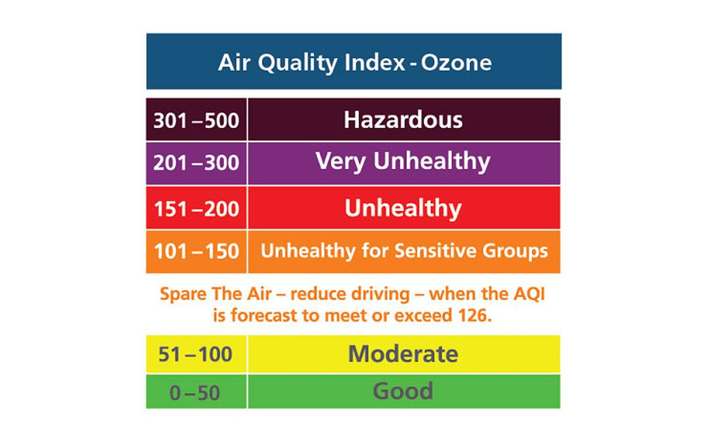
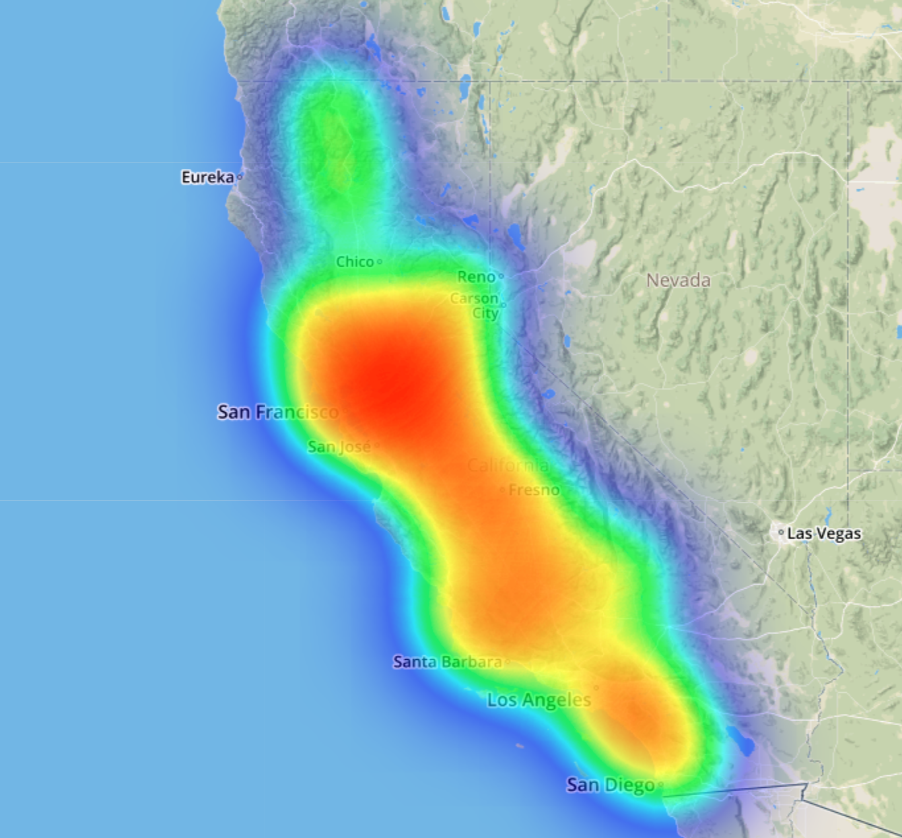
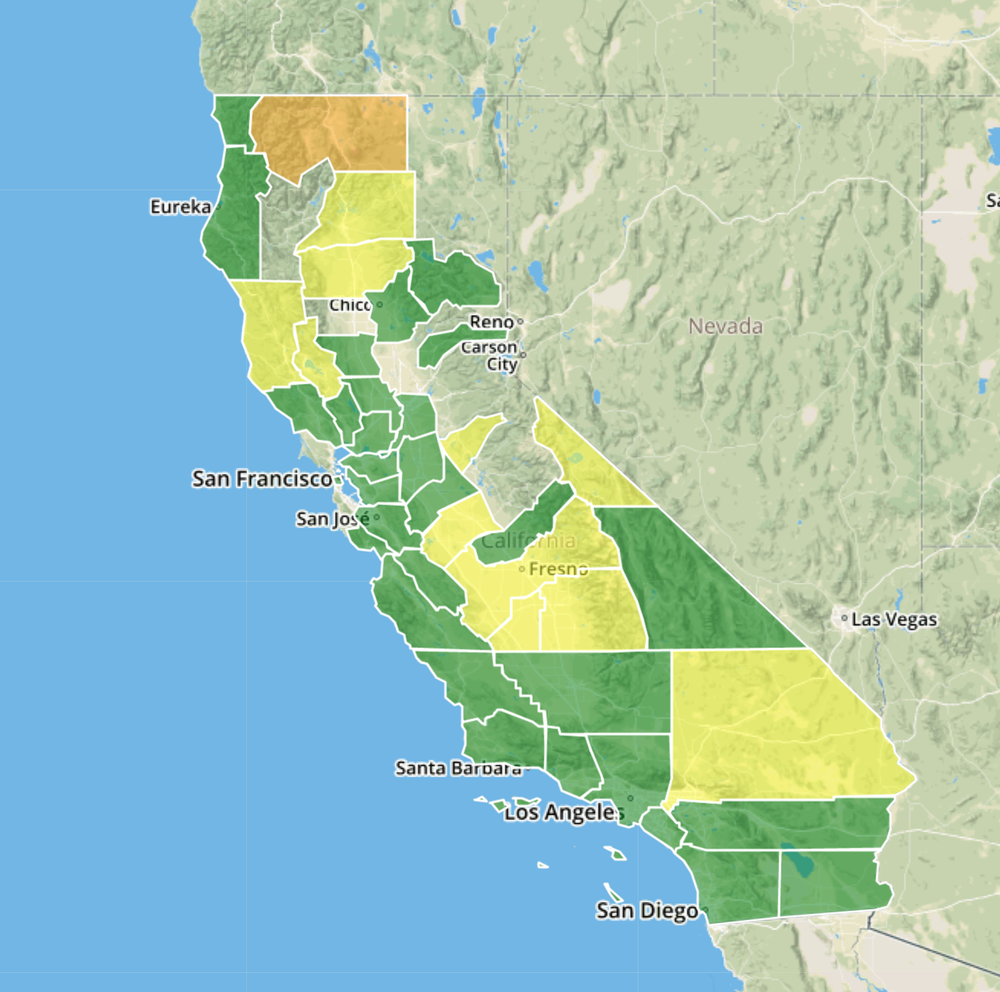
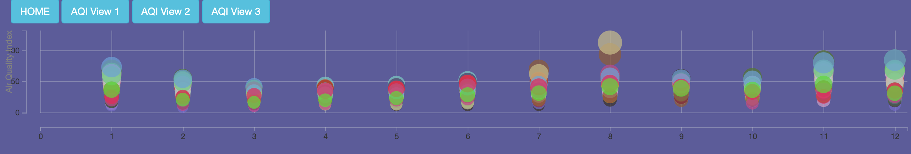

# California Air Quantity Monitor

Long ago, the United States EPA collected and shared AQI data with the world. Then, everything changed when the Trump Administration attacked. Only the AirBenders, masters of data analytics, could stop them, but when the world needed them most, the Trump Administration cut $2 billion or 31% of the EPA’s budget. Six months passed and the AirBenders learned web scraping and although their AirBending skills are great, there is a lot of data to collect before they’re ready to report like the EPA. But I believe the AirBenders can save the world.

The data is from https://aqs.epa.gov/aqsweb/documents/data_api.html. We queried Mar 2014 to Mar 2019 AQI data.

## View 1 - Heatmap

This is California last 5years avg Air Quanlity Index (AQI) by County Heatmap.

  

## View 2 - AQI by month

Use Flask to get data stored in Mongodb. Use Java Script to create map. The color reflects AQI of the selected month.

  

## View 3 - New library - Taucharts

By reading the document, we use new libray Taucharts to better visualize AQI by month by CA county.

  

### Copyright

The AirBenders: Kanika, Jane, & Komal © 2019. All Rights Reserved.
